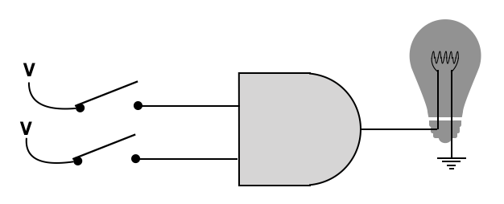
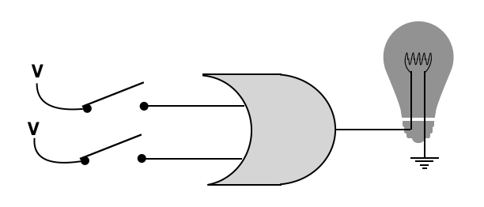
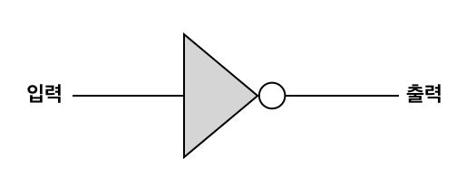
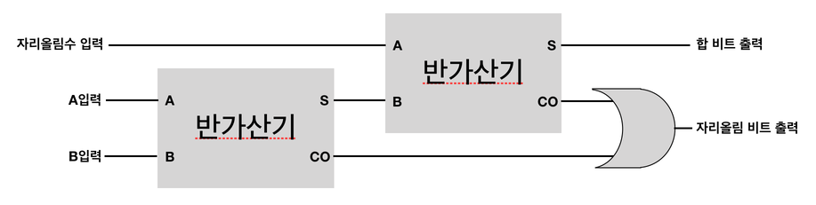

# 디지털 논리회로

## 논리회로

1과 0을 각각 true, false로 하자.

### AND 게이트

설명은 AND 연산자와 같으니 생략한다.

|  A  |  B  | 출력 |
| :-: | :-: | :--: |
|  1  |  1  |  1   |
|  1  |  0  |  0   |
|  0  |  1  |  0   |
|  0  |  0  |  0   |



### OR 게이트

설명은 OR 연산자와 같으니 생략한다.

|  A  |  B  | 출력 |
| :-: | :-: | :--: |
|  1  |  1  |  1   |
|  1  |  0  |  1   |
|  0  |  1  |  1   |
|  0  |  0  |  0   |



입력부분이 오목하다!!

### INVERTER (NOT) 게이트

설명은 ! 연산자와 같다.

|  A  | 출력 |
| :-: | :--: |
|  1  |  0   |
|  0  |  1   |



동그란 부분(버블)이 not 표시다

### NAND 게이트

AND에 버블이 붙은 것이다. AND와 완전히 반대로 작동한다.

|  A  |  B  | 출력 |
| :-: | :-: | :--: |
|  1  |  1  |  0   |
|  1  |  0  |  1   |
|  0  |  1  |  1   |
|  0  |  0  |  1   |

```js
function nand(paramA, paramB) {
  return !(paramA && paramB);
}
```

### NOR 게이트

OR에 INVERTER가 붙은 것이다. OR와 완전히 반대로 작동한다.

|  A  |  B  | 출력 |
| :-: | :-: | :--: |
|  1  |  1  |  0   |
|  1  |  0  |  0   |
|  0  |  1  |  0   |
|  0  |  0  |  1   |

```js
function nor(paramA, paramB) {
  return !(paramA || paramB);
}
```

## 가산기

쉽게말해 덧셈기다.

### 반가산기(half-adder)

쉽게 생각하면 맨 아래 자리의 계산기다.
비트 두개를 입력받아 sum과 carry를 출력한다.

합

|  A  |  B  | 출력 |
| :-: | :-: | :--: |
|  1  |  1  |  0   |
|  1  |  0  |  1   |
|  0  |  1  |  1   |
|  0  |  0  |  0   |

자리올림(carry)

|  A  |  B  | 출력 |
| :-: | :-: | :--: |
|  1  |  1  |  1   |
|  1  |  0  |  0   |
|  0  |  1  |  0   |
|  0  |  0  |  0   |

출력을 더해보면

|  A  |  B  | 출력 |
| :-: | :-: | :--: |
|  1  |  1  |  10  |
|  1  |  0  |  01  |
|  0  |  1  |  01  |
|  0  |  0  |  00  |

인것이다.

이를 코드로 구현하면 carry는 AND Gate다.

합은 a와 b가 다른 경우만 1인 XOR Gate다.

XOR은 `^`로 표현가능하다.

```js
function halfadder(bitA, bitB) {
  var c = bitA && bitB ? 1 : 0;
  var s = bitA ^ bitB ? 1 : 0;
  var answer = [s, c];
  return answer;
}

// ^ 이 연산을 만들자면 아래와 같다.
function xor(a, b) {
  return !(a === b);
}
```

### 전가산기

전가산기는 반가산기인데 이전 자리의 올림여부도 추가로 받는다.

|  A  |  B  |  C  | 출력 |
| :-: | :-: | :-: | :--: |
|  1  |  1  |  0  |  10  |
|  1  |  0  |  0  |  10  |
|  0  |  1  |  0  |  10  |
|  0  |  0  |  0  |  10  |
|  1  |  1  |  1  |  11  |
|  1  |  0  |  1  |  10  |
|  0  |  1  |  1  |  10  |
|  0  |  0  |  1  |  01  |

이런 구조다.

이를 그림으로 표현하면 아래와 같다.



halfAdder 결과의 sum과 carry를 halfAdder에 다시 넣는다.
두 carry의 결과를 OR게이트로 연결하면 된다.

```js
function halfadder(bitA, bitB) {
  var [fs, fc] = halfadder(bitA, bitB);
  var [ss, sc] = halfadder(carry, fs);
  var answer = [ss, sc || fc];
  return answer;
}
```

### byteAdder

8바이트 계산기를 만들어보자!

- 바이트 덧셈(byteadder) : 8비트를 BOOL타입 배열로 2개를 입력 받는다.
- 자리올림(carry) + 전체 합(sum)을 순서대로 배열로 담아서 리턴하는 함수를 구현한다.
- 입력으로 들어오는 byteA, byteB 배열의 길이는 같다고 가정한다.
- 입력으로 들어오는 byteA 비트 순서는 낮은 자리가 배열의 앞쪽에 오도록 표현한다. 배열의 순서대로 보면 이진수가 뒤집혀 있는 것처럼 보인다고 가정한다.

---

- 덧셈 예상 결과

```markdown
byteA = [ 1, 1, 0, 1, 1, 0, 1, 0 ]
byteB = [ 1, 0, 1, 1, 0, 0, 1, 1 ]
결과 = [ 0, 0, 0, 1, 0, 1, 0, 0, 1 ]
```

```markdown
byteA = [ 1, 1, 0, 0, 1, 0, 1, 0 ]
byteB = [ 1, 1, 0, 1, 1, 0, 0, 1 ]
결과 = [ 0, 1, 1, 1, 0, 1, 1, 1, 0 ]
```

---

풀이는 아래와 같다.
하나씩 가져와서 s와 c를 fulladder에 넣는다.
s는 acc에 저장하고 c는 다음 연산에 사용한다.

```js
function byteadder(byteA, byteB) {
  var s;
  var c = 0;
  answer = byteA
    .reduce((acc, cur, i) => {
      [s, c] = fulladder(byteA[i], byteB[i], c);
      return acc.concat(s);
    }, [])
    .concat(c);

  return answer;
}

byteadder([1, 1, 0, 1, 1, 0, 1, 0], [1, 0, 1, 1, 0, 0, 1, 1]);
byteadder([1, 1, 0, 0, 1, 0, 1, 0], [1, 1, 0, 1, 1, 0, 0, 1]);
```

## 진법 변환기

### decimal => binary, binary => decimal

- 10진수를 2진수로, 2진수를 10진수로 변환하는 함수만들기
- 진법변환기는 사실 그렇게 어려운 로직이 없다.
- 그래서 아래에 통합했다.

### 최종

- 앞서 만들었던 이진 덧셈기에 입력과 출력에 연결해서 10진수 덧셈이 동작하는지 여부를 확인한다.

최종 결과물 코드를 아래 링크로 대체

[step-1 최종](./adder.js)
