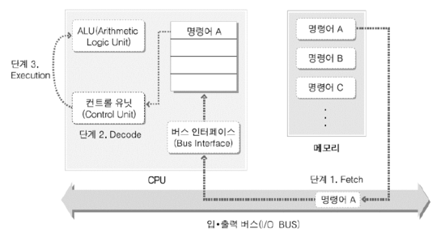
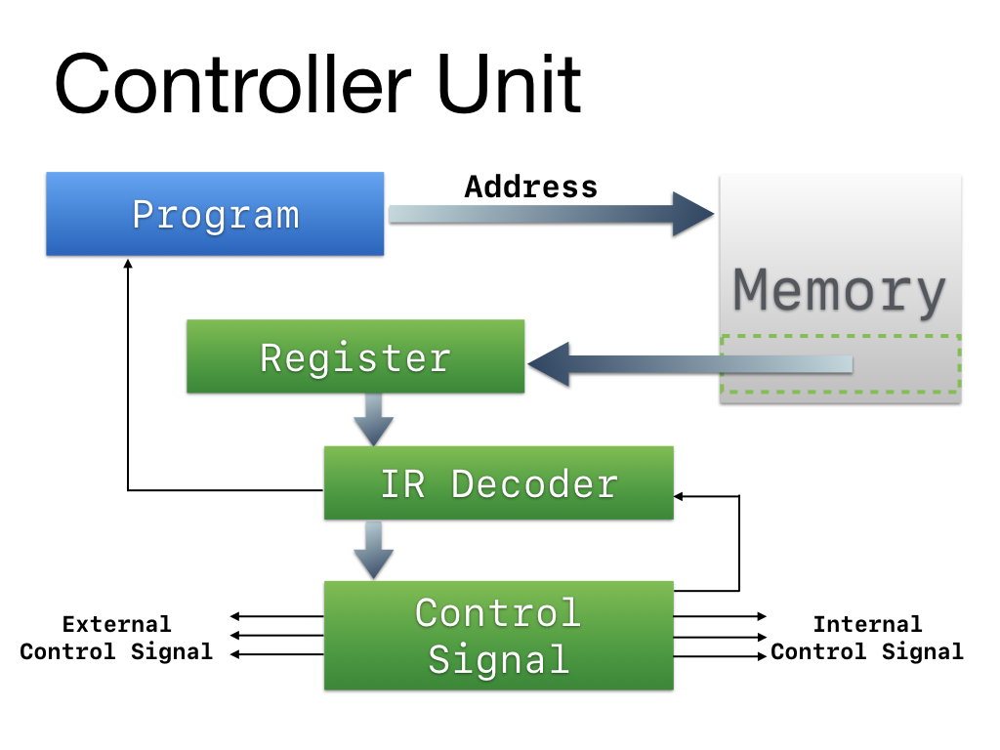
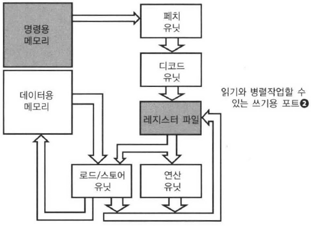
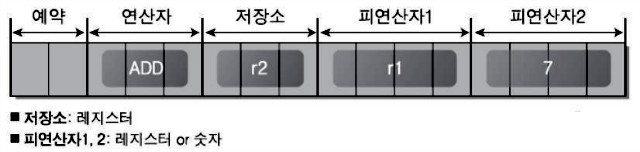

# CPU

## 중앙처리장치

CPU(Central Processing Unit)은 컴퓨터에서 실제 연산이 이루어지는 곳이다. 개발자들이 힘들게 만든 소스코드는 컴파일에 의해 기계어로 번역되어 메모리의 TEXT 영역에 올라간다.

그럼 CPU가 메모리의 이 영역에 접근에 명령어를 하나씩 가져와 해독한 뒤 수행한다.

출처 : 윈도우즈 시스템 프로그래밍

CPU는 위 그림과 비슷하게 Register, ALU(산술 논리 유닛), CU(제어 유닛), CLOCK으로 구성되어 있다.

레지스터가 메모리 계층구조의 레지스터-캐시-메모리-디스크의 그 레지스터다.

CU는 메인보드의 소켓으로 데이터 버스, 제어 버스, 주소 버스로 통해 다른 부품들과 통신한다. 메모리에 있는 명령어를 가져와 해석하는 것도 이 CU가 담당한다.

ALU는 CU의 통제를 받아 단순 연산하는 공간이다.

### 실행 사이클

출처 : 프로세서를 지탱하는 기술

흐름은 여러 다이어그램이 있지만 크게는 다음과 같다.

1. CU가 메모리에서 IR(instruction)을 fetch()하여 register에 할당
2. 받은 IR을 디코딩함
3. 연산을 수행함
4. 이 과정을 반복

### 레지스터

레지스터는 범용 레지스터, 세그먼트, 명령어 포인터, FLAG레지스터와 같은 종류가 있다.

EAX(accumulator), EBX(base), ECX(counter), EDX(extended data), ESI, EBP, EIP 등등 용도에 따라 다양하다.

### 명령어 구조

명령어의 구조는 CPU에 따라 조금씩 상이하다. 편의상 16비트 명령어에 8개의 레지스터를 가진다고 생각하자.

쉽게말해 이런 구조를 가진다.

비트 단위로 끊어서 하는 역할을 다르게 만든다. 위의 경우 r1과 #7을 더해 r2에 저장하는 것이다.

이때 만일 연산자 ADD가 0,0,1으로 표기하기로 약속했다면,

[0,0, 0,0,1, 0,1,0, 0,0,0,1, 0,1,1,1] 이렇게 16비트로 나타낼 수 있을 것이다.

### 참고자료

- [CPU에 대한 이야기](http://blog.naver.com/PostView.nhn?blogId=kater102&logNo=132992151&parentCategoryNo=30&categoryNo=&viewDate=&isShowPopularPosts=false&from=postView)
- [CPU의 구조와 원리](http://blog.daum.net/dasomcap/829)
- [CPU와 메모리 구조](https://d4m0n.tistory.com/12)
- [CPU의 파이프라인 실행의 원리](https://ezbeat.tistory.com/454)
- [CPU를 디자인하자!](http://blog.naver.com/PostView.nhn?blogId=kater102&logNo=134005470&parentCategoryNo=30&categoryNo=&viewDate=&isShowPopularPosts=false&from=postView)
- [마이크로프로세서 (Microprocessor)](http://blog.skby.net/%EB%A7%88%EC%9D%B4%ED%81%AC%EB%A1%9C%ED%94%84%EB%A1%9C%EC%84%B8%EC%84%9C-microprocessor/)
