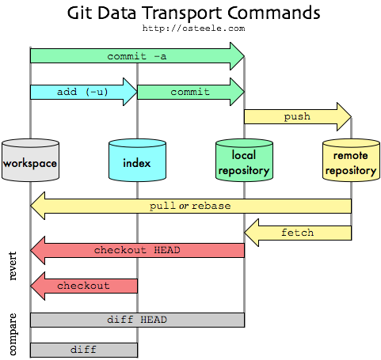
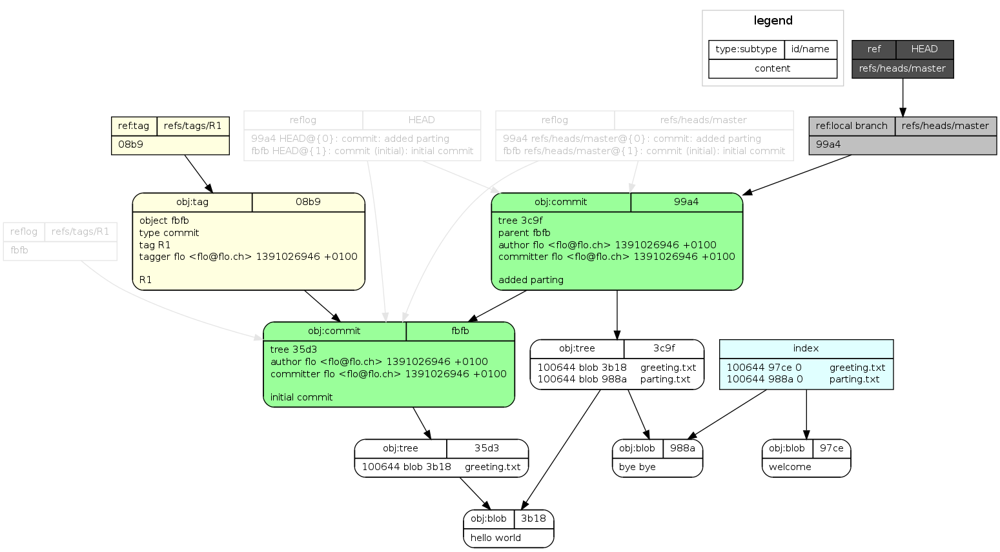

# GIT

깃은 분산된 형상관리 툴(DVCS)이다.

단순하게만 생각하면 별거 없다. 게임 문명을 하다보면... 다른 문명이 내 원더 대신 만들면 돌려서 다른걸 생산해야 한다.

프로젝트도 이처럼 저장과 불러오기가 필요한데 이게 바로 깃이다.

## 개념

기본 개념은 아래의 그림과 같다.

index가 staged, staging area다.

## git init

`init` 명령어는 local repository를 만든다. 이 로컬 저장소는 바로 .git에 들어가있다.

.git에는 아래와 같은 내용이 초기 세팅된다.

    config
    description
    HEAD
    hooks/
    info/
    objects/
    refs/

## git add

add 명령은 working directory의 파일을 staging area로 옮긴다.

그럼 이 staging area(이하 staged)는 뭘까?

staged는 .git의 index다. add를 하는 순간 .git에는 인덱스가 생긴다.

동시에 objects에는 blob타입의 객체가 생성된다. 이는 파일에 대한 내용이다. 파일 내용을 가지고 hash하여 만들어진다.

깃은 모든 파일을 blob 타입의 객체로 관리한다. 그런데 파일의 내용이 기준이기 때문에 파일의 내용이 변경되면 새로운 객체가 생긴다. 파일 두개를 add하면 당연히 두개의 blob객체가 생성되고, 기존의 파일 1개의 내용을 변경하여 add하면 새로운 객체가 생겨 총 3개의 객체가 생성된다.

인덱스는 tree형태로 구성되며 객체의 이름과 hash값을 가진다. 그걸 가지고있으니 추적할 수 있게된다.

## git commit

깃은 커밋이 핵심이다.

게임에서 사실 되돌일 일은 많이 없지 않나? 그래서 저장이 제일 중요하다. 이 저장이 커밋이다.

커밋을 하면 .git/objects/에는 tree, commit 두 개의 객체가 생긴다.

commit객체는 tree객체의 hash와 Author, Date, Msg, 부모 커밋의 hash를 가진다.

tree 객체는 커밋시의 index의 스냅샷을 가진다.

그래서 예를들어 push하면 `Compressing objects: 100% (5/5), done.` 이와 비슷한 표준출력이 발생한다. 5개의 객체가 전달되는 것이다.

## git status

파일을 생성하고 status를 치면 working tree와 index의 blob객체의 내용이 서로 다르다. 그래서 git add 하라고 뜬다.

add 하고 파일을 변경한 뒤 status를 칠 때도 마찬가지다. index의 blob객체와 내용이 다르면 이거 확인하라고 뭐라뭐라 뜬다.

add 상태에서 status를 치면 head -> branch -> commit -> tree 객체의 내용과 index를 비교하여 다른게 있는지 알려준다.

working tree, index, head/branch/commit/tree가 서로 일치하면 클린한 상태가 된다.

## git branch

HEAD는 참조변수다. branch 역시 참조변수다. HEAD는 보통의 경우 branch를 가리킨다. branch는 커밋을 가리킨다.

checkout은 이 HEAD를 변경하는 명령어이며, reset은 HEAD의 참조값과 branch의 참조값을 모두 변경한다.

init부터 여기까지의 어려웠던 내용이 바로 아래 그림이다.

## git pull & git fetch

pull은 remote 저장소의 내용을 받아 working tree 까지 반영한다. 즉 HEAD와 Origin을 일치시킨다.

fetch는 로컬 저장소까지만 가져오고 HEAD는 움직이지 않는다. 이 때 merge 작업을 진행해 HEAD를 움직여준다.

## stash

임시저장소다. 작업하다가 master 브랜치의 버그가 발생한 것을 인지 한경우 커밋을 할 순 없으니 stash에 저장한 뒤 master로 이동한다.

---

### 참고자료

- [git의 원리 (git object를 중심으로)(빨간색코딩)](https://sjh836.tistory.com/37)
- [쩜깃의 이해](https://jusths.tistory.com/64)

두 사이트 모두 정말 큰 도움 됐습니다.
