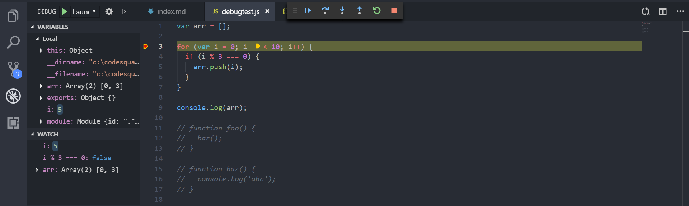
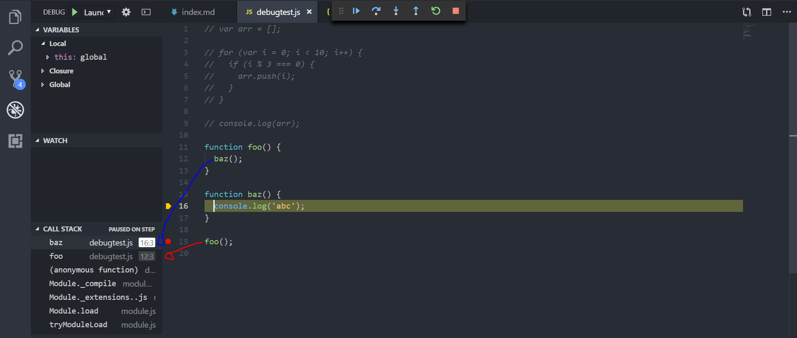

# JavaScript

## 자바스크립트와 패러다임

### compiled언어와 interpreted언어

#### 컴파일

사람이 읽기 좋은 코드를 컴퓨터가 실행할 수 있는 기계어로 바꾸어주는 작업

장점

- interpreted보다 빠르다. 이미 기계어기 때문에 실행하는동안 다른 작업이 필요하지 않다.
- 컴파일 시에 문제가 있다면 알려준다. 즉 실행되기 이전에 수정할 수 있다.

단점

- OS에 종속된다. Linux에서 컴파일 된 파일은 Windows에서 실행할 수 없으므로 windows에서 재컴파일 해주어야 한다.

#### 인터프리터

코드를 machine code로 바꾸지 않고 코드를 한줄 씩 해석하며 실행시킨다.

장점

- 인터프리터만 설치되어 있다면 OS에 상관없이 동작한다.
- 또한 수정 시 컴파일은 소스코드를 찾아가 고쳐야 하는데 그런 작업이 필요하지 않다.

#### 자바스크립트

JS는 기본적으로는 인터프리터 언어다. 그러나 자바스크립트를 해석하는 엔진에 따라 해석하기 쉽게 컴파일을 하는 경우가 있다. 이는 양쪽의 장점을 모두 취하기 위함이다.

### 패러다임

자바스크립트는 다양한 방식의 프로그래밍 패러다임을 지원한다. 이를 멀티 패러다임 언어라고 한다.

- imperative (명령형)
  - 선언형 프로그래밍과 반대되는 개념이며 절차지향(procedural)과 같음.
  - 거의 대부분의 하드웨어가 이 방식이다.
  - 순차적으로 실행되며 요리법처럼 a를하고 b를하고 c를하라고 명령을 내린다.
- declarative (선언적)
  - 명령형과 대비되는 다른 언어를 모두 통칭한다.
  - 알고리즘은 없고 목표만 있다.
  - 대표적인 예로 HTML이 있다. 순서대로 일어나지 않고 알고리즘도 없다. 목표만 있다.
  - 함수형, 질의어(sql)도 역시 선언적임
- functional (함수형)
  - 수학의 함수에서 시작 됨. 람다대수의 기반을 둔 프로그래밍 방식
  - 기존의 명령형에서 상태의 값(변수)을 변경하며 생기는 부작용을 제거하고자 함
  - 순수함수(외부의 상태와 관련이 적은)를 작성하여 우리 코드는 입력과 출력의 관계만 입력하도록 하는 것
- event-driven(이벤트중심)
  - user input, sensor output, message와 같은 특정 이벤트를 기반으로 프로그램의 흐름이 움직이는 방식이다.
  - 아주 쉽게는 클릭하면 프로그램의 어떤 기능이 실행되는 버튼

## 디버깅

우리는 VSCODE를 이용한다. VS code는 NODE.js 런타임을 위해 내장으로 지원한다. javascript로 컴파일되는 모든 언어(TS, CoffeeScript 등)를 모두 지원한다.

디버깅 툴은 에디터 별로 다르므로 어느정도 능숙하게 다루면 좋다.

### short cut

편하게 쓰려면 단축키는 필수!!

| 모드               | 단축키           |
| ------------------ | ---------------- |
| Debug              | Ctrl + Shift + d |
| Explorer           | Ctrl + Shift + e |
| Continue / Pause   | F5               |
| Run without Debug  | Shift + F5       |
| Step Over          | F10              |
| Step Into          | F11              |
| Step Out           | Shift+F11        |
| Restart            | Ctrl+Shift+F5    |
| Stop               | Shift+F5         |
| Breakpoints        | F9               |
| Inline-Breakpoints | Shift + F9       |

### Breakpoints

breakpoint는 말그대로 중단점이다. 코드 실행을 중간에 멈추는 부분이다. 우리는 중단점을 만들어 코드 실행을 멈추고 코드 진행을 좀 더 깊게 바라볼 수 있다.

그 예로 멈춘 상태로 변수의 값을 확인할 수 있다.

위 그림은 for문에서 breakpoint를 설정했다. 좌측을 보면 variables에 변수(i, arr)의 값을 확인 할 수 있다.

watch는 관심있는 변수나 evaluated expression 값을 관찰할 수 있다.

#### breakpoints의 종류

- expression condition
  - 조건을 설정할 수 있다. 예를들어 위의 경우 i=5를 설정하면 i가 5일 때부터 멈춘다.
- hit point
  - 이건 아직 모르겠다. 추후 더 조사해보자.
- inline breakpoints
  - 라인 안에서도 break point를 나눌 수 있다.
- function breakpoints
  - 함수 이름으로 중단점을 생성할 수 있다.

### Call Stack

break point로 중단점을 만들었을 때의 call stack의 형태를 볼 수 있다.

call stack을 예상해보면 `foo -> baz -> console.log()`의 형태다. 따라서 위의 사진처럼 foo 위에 baz가 올라간 모습을 볼 수 있다.

### Step over / Step into/ Step out

위 내용은 [google chrome devtools](https://developers.google.com/web/tools/chrome-devtools/javascript/step-code?hl=ko) 에서 너무 좋게 설명되어있어 그 설명으로 대체합니다.

- Step Over : 다음 줄에 나오는 명령을 실행하고 다음 줄로 점프합니다.
- Step Into : 다음 줄에 함수 호출이 포함되어 있다면 Step Into는 해당 함수로 점프하고 첫 줄에서 멈춥니다.
- Step Out : 현재 함수의 나머지 부분을 실행한 다음 함수 호출 뒤 다음 명령문에서 일시 중지합니다.
