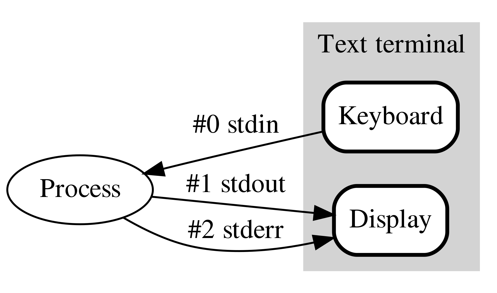

# Linux

## UNIX 와 LINUX

UNIX는 비싼것. 그걸 타넨바움 교수가 교육용 UNIX인 Minix를 만든다. 이걸 리누스 토르발스라는 학생이 리눅스로 만들었다.

이 리눅스는 사실 리눅스 커널을 의미한다.

## 쉘

쉘이란 리눅스의 커널을 사용자와 연결해주는 User Interface다. 사용자의 cli 명령어를 해석하는 프로그램이다. 우리가 mac의 terminal, iterm, bash라고 부르는 것들은 그냥 쉘을 여는 터미널이며 프로그램이다.

## 운영체제 간단정리

- program : 기계어 명령어의 집합
- process : 실행중인 프로그램
- execute : 메모리에 올라간다
- cpu : program을 메모리에 올려 execute하는 친구
- ls 명령을 shell에서 실행한다는 것
  - ls라는 프로그램(/bin/ls)을 실행해주는것(shell의 자식 process가 됌)
  - 즉 shell은 그냥 프로그램을 실행시켜주는 것
- 프로세스란
  - 부모 - 자식 프로세스의 관계를 가진다.
  - 모든 OS는 최상위 조상 프로세스가 있다. (부팅 시)

## 표준스트림


기본적으로 위 그림과 같이 프로세스는 표준 스트림을 가진다.

- 표준입력 : 0
- 표준출력 : 1
- 표준에러 : 2

## 명령어

명령어도 사실 이미 정의된 프로그램이다. 어차피 리눅스 명령어는 생소하기 때문에 사용할 때는 구글링을 많이 할 것이다. 이해를 돕기위한 간단한 명령어만 정리해보자.

- pwd : 현재 디렉토리를 확인
- ls : 디렉토리 내용을 보여줌.
  - `ls *` `ls -l` 처럼 옵션을 가지고 있음
- mkdir : 디렉토리생성
- cd : change directory
- cat : argument를 받아 표준 출력으로 바꿔줌
- history : 최근 사용한 명령어 이력을 보여줌
- touch : 0바이트 파일생성

다시 정리하지만 명령어는 정말 많고 다 외울수는 없다. 따라서 자주쓰이는 간단한 명령어들은 외워지게 하고 그 외에는 필요할 때 찾아쓰자

## Linux redirection & pipe

두가지 모두 표준 스트림을 바꾸어 놓는 친구다.

### redirection

redirection에는 두가지 종류가 있는데 `>` `<` 이렇게 두가지가 있다. 두가지 모두 파일을 사용할 때 유용하다.

#### >

흐름을 바꾸는 데 왼쪽의 출력을 오른쪽의 파일로 보냅니다.

```linux
echo "hello world" > hello.txt
```

echo 명령어의 표준 출력을 오른쪽의 파일의 내용으로 만듭니다.

즉 왼편의 내용을 파일로 이용할 때 유용합니다.

#### <

흐름을 바꾸는 데 오른쪽의 파일을 왼쪽의 입력으로 보냅니다.

```linux
mutt -s "Test from mutt" user@example.com < message.txt
```

mutt라는 것은 mail을 보내는 명령어입니다.

`mail [제목] [받는이] [내용]` 이런식으로 사용하는데 메일의 내용을 오른편의 message.txt에서 가져와 사용합니다.

### pipe

| 이렇게 생긴 친구다.

이 역시 흐름을 바꾸어주는 역할을 하는데 왼쪽의 표준 출력을 오른쪽의 표준 입력으로 만들어 준다.

```linux
ls * | grep Down
```

이렇게 사용하면 ls의 결과가 grep의 표준입력이 된다.

# VIM

VIM은 리눅스 위에서 사용되는 에디터다. 방향키와 마우스를 사용하지 않고 수정하는 에디터다. VI + improved라서 vim이라고 부른다.

## mode


vim은 위와 같은 모드가 있다. 기본적으로 normal모드고 i키를 눌러 insert모드, :를 눌러 command mode에 접근 할 수 있다.

### 간단 명령어

역시 명령어는 필요할 때 구글링이 최고니 간단하게만 정리해보자.

- 커서이동 : h j k l
- 삭제 : x
- 이동 : e, w, b (end, word, back)
- 입력모드 : i, I, o, O, a, A
- 복사: yy
- 붙여넣기: p
- 나가기 : :q
- 저장 후 나가기 : :wq

### 숫자

vim의 장점 중 하나는 숫자 기능인 것 같다.

예를 들어 이동시에 `3w`라고 하면 단어 3개를 건너 뛴다. 또한 `30i`를 입력하고 test를 입력한 뒤 `esc`를 누르면 test가 30번 입력된다.
