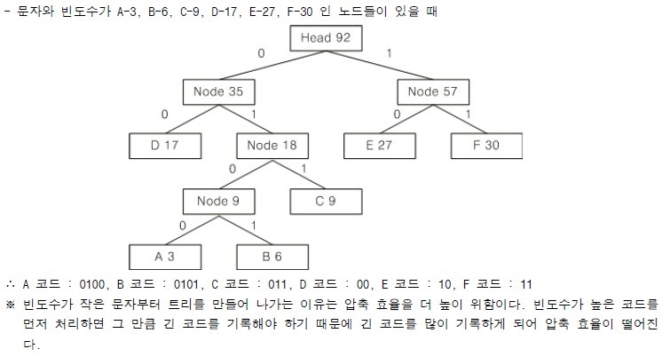

# 압축

압축은 크게 두가지 종류로 나뉜다. 데이터 손실압축과 데이터 비손실압축 두가지의 종류가 있다.

데이터 손실 압축은 우리가 흔히 보는 사진, 영상의 해상도를 낮추는 압축이다. 사진의 픽셀을 일부 제거해 원본데이터가 손상되지만 사진을 보는데는 큰 지장이 없다.

이런 경우 손실 압축을 해도 큰 상관이 없다. 그렇지만 문서의 경우는 다르다.
'내가 A에게 500만원을 보냈다' 라는 정보를 압축했는데 원본 데이터에 손실이 일어나면 큰일이다.
따라서 이 경우 데이터 비손실 압축으로 압축해야 한다.

## 비손실 압축

비손실 압축에는 크게 Run-Length, LZ(lempel-ziv), Huffman 등이 있다. 이 세가지가 가장 대표적이며 보통의 압축 알고리즘은 결국 이 세가지를 조합하거나 조금씩 변형한 것들이다.

### Run-Length

만일 데이터가 `WWWWWWWWWWWWBWWWWWWWWWWWWBBBWWWWWWWWWWWWWWWWWWWWWWWWBWWWWWWWWWWWWWW` 이렇게 생겼다고 가정하자.

이를 `12WB12W3B24WB14W`로 변경한다면 데이터를 손쉽게 압축할 수 있다. 압축을 해제하는 것 역시 직관적이며 쉬울 것이다.

인코딩 이전의 데이터는 67글자였으나 인코딩 이후의 데이터는 16글자다.

이 알고리즘의 단점은 일정한 패턴의 데이터를 압축할 수 없다는 점이다. `BWWBWWBWWBWWBWWBWW` 이 데이터는 Run-Length를 이용해 처리할 수 없다.

### LZ(lempel-ziv)

LZ 알고리즘은 기본적으로는 Run-Length의 방식과 동일하다. Run-Length는 글자 하나를 기준으로 한다면 LZ는 단어를 기준으로 한다. 이를 사전방식(Dictonary methods)이라고 한다.

예를들어 다음과 같은 문장이 있다고 하자.

`TOBEORNOTTOBETONOT` 이걸 압축해보자.

`TOBEORNOT TOBE TONOT` 저 가운데 TOBE는 사실 앞에서 한번 쓰였다. 그럼 굳이 다시 쓰지 않고 앞에서 쓰였다고 표시만 해주면 되지 않을까? 이 개념이 LZ알고리즘이다.

그래서 아래와 같은 결과를 가진다.

`TOBEORNOT TOBE TO NOT`

`[TOBEORNOT][9,4][4,2][9,3]`

이런식의 블록을 만든다. [9, 4]의 의미는 9번째 떨어진 곳으로부터 4글자가 반복되므로 그걸 사용하라는 의미다.

실제로 완전히 이렇게 생긴것은 아니다. 실제로는 `(0,0)T (0,0)O (0,0)B ... (9,4)T (4,2) N...` 대충 이런식의 형태를 띈다. 참고로 저건 그냥 예시다. 저 TOBEORNOT... 의 인코딩 결과와는 다르다.

그럼 실제 긴 텍스트를 블록 형태의 데이터로 변환할 수 있다.

이러한 LZ 알고리즘은 LZ77, LZ78, LZMA, LZSS 등 엄청 다양한 알고리즘이 있다.

그 차이는 블록(토큰)을 얼마나 길게 나누느냐에 따라 조금씩 다르다. TOBE를 TO BE의 두개의 블록으로 나눌 수 있듯 말이다.

LZSS = winRAR, LZMA = 7zip 등 압축 형식에따라 조금씩 다른 알고리즘을 사용한다.

### Huffman Coding

허프만 코딩은 지난 글에서 설명한 엔트로피와 관련이 깊다. 물론 다른 알고리즘도 엔트로피와 연관이 있지만 이건 더 직관적으로 이해되게 연결된다. 글의 흐름을 따라가보자.

#### ASCII CODE

아스키 코드는 256개의 문자를 7비트 혹은 8비트로 나타내는 규칙이다. 예를들어 abcd라는 글자는 1100001 1100010 1100011 1100100로 나타낼 수 있다. 이런식으로 모든 글자를 치환하는것이 가능하다.

이는 고정 길이 코드(Fixed Length Code)다. 그래서 단점이다.

e와 x가 한 문서에 등장할 확률은 다르다. 정보이론에 따르면 확률이 다른 글자는 e와 x는 같은 한 글자지만 정보량이 다르다.

그런데 7, 8비트로 고정해버리면 다른 각각의 정보량을 같게 표현해버린다.

즉 고정길이코드는 항상 최대 정보량을 사용하게 된다.

#### 가변 길이 코드

그래서 나온 개념이 가변 길이 코드다. 예를들어 문서에는 space, e, s, t, i, a ... 의 순서로 글자가 나온다고 하자.

`space : 0, e : 1, s : 00, t: 01, i: 10, a: 11 ...` 이런식으로 가변길이의 비트를 부여한다. 그럼 문서의 총 비트수는 엄청나게 줄어들 수 있을 것이다.

여기에는 매우 치명적인 단점이 있다. 고정비트의 경우 8비트를 한 문자로 보고 끊어 읽으면 된다. 그런데 가변비트는 그럴 방법이 없다. `0011010010101...`의 코드가 있다고 하자. 그럼 앞에서부터 읽을 때 읽어야할 글자가 0(space)인지 00(s)인지 001인지 모른다.

#### 접두어 코드(prefix code)

가변 길이 코드의 문제는 [0, 1, 01, 010]의 식으로 코드를 부여하면 중복이 발생한다는 점이다. 그럼 중복이 발생하지 않게 부여하면 어떨까??

예를들어 a,b,c,d를 [00, 010, 100, 101]으로 부여한다면 헷갈리지 않을 것이다. 이게 바로 허프만 코딩이다.

#### 허프만 트리

허프만은 빈도가 높은 글자를 작은 코드로 만들면서 동시에 서로 중복이 발생하지 않는 코드를 만들려고 이진트리 개념을 사용했다.

[출처](https://spherez.blog.me/60175047026)

이진 트리를 기준으로 왼쪽은 0, 오른쪽은 1을 부여하면 된다.

그림처럼 {D: 00, E: 10, F: 11, C: 011, A: 0100, B: 0101}로 비트를 부여한다면 서로 중복되지 않고 비트를 빈도를 기준으로 부여할 수 있다.

이 경우 어떤 글자는 8비트를 훨씬 넘어선다. 중복을 제거했으니 경우의 수가 늘어난다.

그런데 그래도 괜찮다. 문서에 얼마 안나오기 때문이다.

## Gzip

HTTP 통신 시 자주 사용되는 Gzip은 Deflate 알고리즘을 사용하는 알고리즘이다.

Deflate는 데이터를 우선 LZ77 알고리즘을 사용하여 압축한 결과를 Huffman Coding으로 한번 더 압축하는 방식을 사용한다.

---

참고자료

- 리버싱 핵심원리, 이승원, 인사이트
- [Text Compression for Web Developers](https://www.html5rocks.com/ko/tutorials/speed/txt-compression/)
- [Raul Fraile: How GZIP compression works](https://2014.jsconf.eu/speakers/raul-fraile-how-gzip-compression-works.html)
- [The LZ77 Compression Family (Ep 2, Compressor Head)](https://www.youtube.com/watch?v=Jqc418tQDkg)
- [How Computers Compress Text: Huffman Coding and Huffman Trees](https://www.youtube.com/watch?v=JsTptu56GM8)
- [허프만 코딩을 이용한 데이터 압축](https://softwareji.tistory.com/5)
- [DEFLATE](https://ko.wikipedia.org/wiki/DEFLATE)
